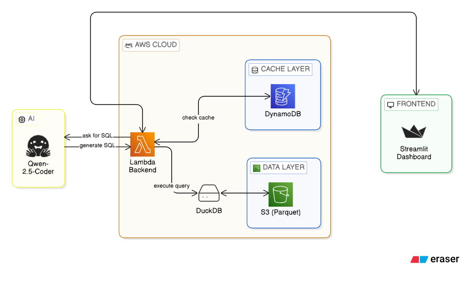

# AI Querier: Natural Language to SQL

A side project built to explore **Serverless Architectures** and **LLM integration**. This tool allows you to chat with a Parquet dataset stored on **AWS S3** using plain English (or Italian), converting questions into **DuckDB** queries on the fly. The interactive dashboard is available [here](https://ai-sql-querier-montanaro.streamlit.app/).

## How it works
The workflow is straightforward:
1. **User Input**: A question is asked through a **Streamlit** dashboard.
2. **Caching**: The **AWS Lambda** backend first checks **DynamoDB** to see if that specific question has been asked before (using a Regex-based normalization to catch similar phrasing). This is done just to avoid wasting the preciuos free HuggingFace tokens.
3. **SQL Generation**: If there is no cache hit, the request goes to a **Qwen-2.5-Coder** model via Hugging Face to write the SQL.
4. **Serverless Execution**: **DuckDB** runs the generated SQL directly against the `.parquet` file on **S3**.
5. **Visualization**: Data is sent back and rendered into interactive **Plotly** charts.

## The Stack
* **Backend**: Python (AWS Lambda)
* **Database Engine**: DuckDB (for fast OLAP operations on S3)
* **Caching**: Amazon DynamoDB
* **Storage**: Amazon S3 (Parquet)
* **AI**: Hugging Face Inference API
* **Frontend**: Streamlit

